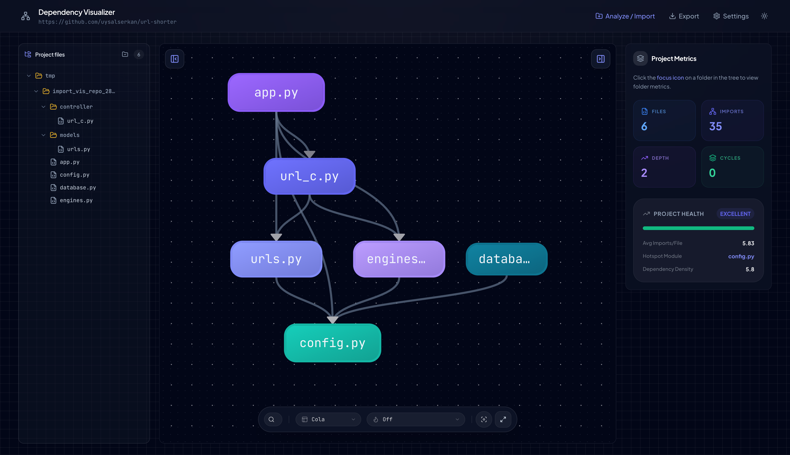

# Dependency Visualizer

A modern web application for visualizing import dependencies in **Python, JavaScript, TypeScript, Go, and Java** projects. Understand your project structure through interactive, beautiful graphs.



**Supported Languages:**
- **Python** (`.py`) - Full AST parsing with relative/absolute import resolution
- **JavaScript** (`.js`, `.jsx`, `.mjs`, `.cjs`) - ES6 imports, CommonJS require, dynamic imports
- **TypeScript** (`.ts`, `.tsx`) - All JS features + type imports, path aliases (`@/`, `~/`)
- **Go** (`.go`) - Module-based imports, stdlib detection, internal packages
- **Java** (`.java`) - Maven/Gradle/Plain Java projects, package-based resolution, static imports


## Features

### Core Features (Phase 1)
- ✨ **Interactive Graph Visualization** - Explore dependencies with zoom, pan, and click interactions
- 🔍 **Smart Analysis** - Detect circular dependencies, isolated modules, and import patterns
- 📊 **Project Metrics** - Get insights into project structure and complexity
- 🎨 **Modern UI** - Beautiful, responsive design with multiple layout algorithms
- 🔎 **Search & Filter** - Find modules quickly and filter external packages
- ⚡ **Fast** - Analyze hundreds of files in seconds using Python AST parsing
- 🔧 **Extensible** - Plugin architecture ready for additional languages

### Phase 2 Features (NEW) ✨
- 🏆 **Module Importance Scoring** - PageRank and betweenness centrality analysis
- 📄 **File Content Preview** - View source code directly from the graph
- 💊 **Project Health Dashboard** - Automated health score and insights
- 🎯 **Smart Recommendations** - Actionable advice for improving code structure
- 📈 **Enhanced Metrics** - Detailed import statistics and hub module identification
- 💾 **Graph Export** - Download as JSON, GraphML, or GEXF
- 🔍 **Detailed Cycle Analysis** - In-depth circular dependency information with severity levels
- 📊 **Import Statistics** - Average imports, most imported modules, and trends

### Phase 3 Features (NEW) 🚀
- ⚡ **Parallel Processing** - 5-10x faster analysis with multiprocessing
- 💾 **SQLite Caching** - Persistent results across sessions
- 🌙 **Dark Mode** - Complete theme support with toggle
- ⌨️ **Keyboard Shortcuts** - Cmd+K for search, Esc to clear/exit
- 🖥️ **Full Screen Mode** - Immersive graph view with one click
- ✅ **Comprehensive Tests** - >80% code coverage
- 🎯 **Loading Indicators** - Better UX with progress feedback

### Phase 4 Features (NEW) 🌍
- 🌐 **Multi-Language Support** - Python, JavaScript, TypeScript, Go, and Java
- 🎯 **Smart Import Resolution** - Relative paths, path aliases, Go modules, Maven/Gradle
- 📦 **Repository Analysis** - Analyze projects from Git URLs (GitHub, GitLab, Bitbucket, private servers)
- 🔌 **Plugin System** - Extensible architecture for custom parsers
- 🛠️ **CLI Tool** - Command-line interface for CI/CD
- 📊 **Comparison Mode** - Before/after analysis with diff
- 🔍 **Language Detection** - Automatic multi-language identification

## Quick Start

### Using Docker (Recommended)

```bash
# Clone or navigate to the project
cd dependency_visualizer

# Start all services
docker-compose up

# Access the application
# Frontend: http://localhost:5173
# Backend API: http://localhost:8000
# API Docs: http://localhost:8000/docs
```

### Manual Setup

#### Backend

```bash
cd backend

# Install uv if you haven't
# curl -LsSf https://astral.sh/uv/install.sh | sh

# Install dependencies
uv sync --dev

# Run the server
uv run uvicorn app.main:app --reload --host 0.0.0.0 --port 8000
```

**Optional – faster parsing with Go extractor:** Build the Go extractor for significantly faster analysis on large projects:

```bash
cd extractor && go build -o extractor . && cd ..
# In backend .env: GO_EXTRACTOR_PATH=/path/to/dependency_visualizer/extractor/extractor
```

See `extractor/README.md` for details.

#### Frontend

```bash
cd frontend

# Install pnpm if you haven't
# npm install -g pnpm

# Install dependencies
pnpm install

# Run the development server
pnpm dev
```

## Usage

1. **Open the Application** - Navigate to `http://localhost:5173`

2. **Enter Project Path** - Enter the absolute path to a Python project
   ```
   Example: /Users/yourname/projects/my-python-app
   
   Try the sample project:
   /Users/serkan.uysal/Documents/dependency_visualizer/sample_project
   ```

3. **Analyze** - Click "Analyze Project" to generate the dependency graph

4. **Explore**:
   - Click nodes to see module details and view source code
   - Use search to find specific modules
   - Change layouts for different views
   - Toggle external packages visibility
   - View metrics, insights, and health dashboard
   - Export graph in multiple formats

## Architecture

### Backend (`backend/`)

- **FastAPI** - Modern async web framework
- **Python AST** - Native import parsing (zero external dependencies)
- **NetworkX** - Graph analysis and algorithms
- **Pydantic** - Type-safe data models

Key components:
- `parser/` - Language-specific parsers (Python AST)
- `graph/` - Dependency graph builder and analyzer
- `api/` - REST endpoints

### Frontend (`frontend/`)

- **React 18 + TypeScript** - Type-safe UI components
- **Vite** - Lightning-fast build tool
- **Cytoscape.js** - High-performance graph rendering
- **TailwindCSS** - Modern, utility-first styling
- **Zustand** - Lightweight state management
- **TanStack Query** - Smart data fetching

## API Documentation

Once the backend is running, visit:
- **Swagger UI**: `http://localhost:8000/docs`
- **ReDoc**: `http://localhost:8000/redoc`

### Key Endpoints

#### POST `/api/analyze`
Analyze a Python project and return dependency graph with importance scores.

**Request:**
```json
{
  "project_path": "/path/to/project",
  "include_external": false,
  "ignore_patterns": [".venv", "__pycache__"]
}
```

**Response:**
```json
{
  "id": "uuid",
  "nodes": [{
    "id": "file.py",
    "pagerank": 0.15,
    "betweenness": 0.08,
    ...
  }],
  "edges": [...],
  "metrics": {
    "total_files": 42,
    "total_imports": 156,
    "circular_dependencies": [],
    "max_import_depth": 5,
    "cycle_details": [...],
    "statistics": {
      "avg_imports_per_file": 3.7,
      "hub_modules": [...]
    }
  }
}
```

#### GET `/api/analysis/{id}/file-preview` (Phase 2)
Get file content and import details.

**Query Parameters:**
- `file_path`: Path to the file

**Response:**
```json
{
  "file_path": "/path/to/file.py",
  "content": "import os\n...",
  "line_count": 150,
  "size_bytes": 4096,
  "imports": [...]
}
```

#### GET `/api/analysis/{id}/export` (Phase 2)
Export graph in various formats.

**Query Parameters:**
- `format`: `json`, `graphml`, or `gexf`

Returns downloadable file.

#### GET `/api/analysis/{id}/insights` (Phase 2)
Get automated insights and recommendations.

**Response:**
```json
{
  "health_score": 85,
  "health_status": "good",
  "insights": [
    {
      "type": "warning",
      "title": "Circular Dependencies Detected",
      "severity": "medium"
    }
  ],
  "recommendations": [
    {
      "title": "Break Circular Dependencies",
      "priority": "high"
    }
  ]
}
```

## Development

**All test-related scripts are optional.** Scripts whose name contains `test` (e.g. `test`, `test:ci`, `test:cov`) are not required for build or run. Use them only when you want to run tests.

### Backend

```bash
cd backend

# Format code
uv run ruff format .

# Lint
uv run ruff check .

# Optional: run tests (requires: uv sync --extra dev)
uv run test
uv run test:cov      # with coverage
uv run test:verbose  # verbose output
```

### Frontend

```bash
cd frontend

# Type check
pnpm tsc

# Lint
pnpm lint

# Build for production
pnpm build

# Preview production build
pnpm preview

# Optional: test scripts (no runner configured by default)
pnpm test
pnpm test:ci
```

## Project Structure

```
dependency_visualizer/
├── backend/                 # FastAPI backend
│   ├── app/
│   │   ├── api/            # REST endpoints
│   │   ├── core/
│   │   │   ├── parser/     # AST parsers
│   │   │   └── graph/      # Graph analysis
│   │   └── main.py         # FastAPI app
│   ├── tests/
│   └── pyproject.toml
│
├── frontend/                # React frontend
│   ├── src/
│   │   ├── components/     # UI components
│   │   ├── hooks/          # Custom hooks
│   │   ├── lib/            # Utilities & API
│   │   ├── stores/         # Zustand stores
│   │   └── types/          # TypeScript types
│   └── package.json
│
└── docker-compose.yml       # Docker orchestration
```

## Configuration

### Backend

Create `.env` file from `.env.example` or set environment variables:

```bash
cp backend/.env.example backend/.env
```

**Key settings:**
- `REPOSITORY_ALLOWED_HOSTS` – Comma-separated Git hosts (e.g. `github.com,gitlab.com`). **Empty = allow all hosts** (for private/custom Git servers).
- `MAX_PROJECT_SIZE_GB` – Maximum project size (default: 10GB)
- `CACHE_TTL_DAYS` – Cache retention (default: 7 days)
- `EXTRACTOR_BACKEND` – `auto`, `python`, or `go` (default: auto)

**For private Bitbucket or custom Git servers:**

```bash
# Option 1: Add your host to the allowlist
REPOSITORY_ALLOWED_HOSTS=github.com,gitlab.com,bitbucket.mycompany.com

# Option 2: Allow all hosts (empty value)
REPOSITORY_ALLOWED_HOSTS=
```

Edit `backend/pyproject.toml` for dependencies and settings.

Default ignore patterns:
- `.venv`, `venv` - Virtual environments
- `__pycache__` - Python cache
- `.git` - Git directory
- `node_modules` - Node modules

### Frontend

Edit `frontend/vite.config.ts` for build settings.

The frontend proxies `/api` requests to the backend automatically.

## Extending for New Languages

The architecture uses a **strategy pattern** for language-specific import resolution. JavaScript/TypeScript support is fully implemented. To add a new language:

### 1. Create a Parser

Create a parser in `backend/app/core/parser/`:

```python
# backend/app/core/parser/ruby.py
from pathlib import Path
from app.api.models import ImportInfo

class RubyParser:
    def get_supported_extensions(self) -> list[str]:
        return [".rb"]
    
    def parse_file(self, file_path: Path) -> list[ImportInfo]:
        # Parse Ruby require statements
        # Return list of ImportInfo objects
        ...
```

### 2. Create an Import Resolver

Create a resolver in `backend/app/core/graph/resolvers/`:

```python
# backend/app/core/graph/resolvers/ruby.py
from pathlib import Path
from app.core.graph.resolvers.base import ImportResolver

class RubyImportResolver(ImportResolver):
    def get_supported_extensions(self) -> list[str]:
        return [".rb"]
    
    def resolve_import(self, source_file: str, import_module: str) -> str | None:
        # Resolve Ruby require to actual file path
        # Return absolute path or None if external (gem)
        ...
```

### 3. Register Parser & Resolver

Register in `backend/app/core/parser/factory.py`:

```python
ruby_parser = RubyParser()
for ext in ruby_parser.get_supported_extensions():
    cls._parsers[ext] = ruby_parser
```

Register in `backend/app/core/graph/resolvers/factory.py`:

```python
if ext in [".rb"]:
    return RubyImportResolver(project_root)
```

### 4. Test

Create tests in `backend/tests/test_ruby_resolver.py` and verify resolution works correctly.

**Examples:**
- ✅ **Python**: Relative imports (`.module`), absolute imports, `__init__.py` packages
- ✅ **JavaScript/TypeScript**: Relative (`./`, `../`), path aliases (`@/`, `~/`), index files, tsconfig.json
- ✅ **Go**: Module imports, stdlib detection, internal packages, go.mod parsing

## Roadmap

### ✅ Phase 1 - MVP (COMPLETE)
- [x] Python AST parser
- [x] File discovery with .gitignore support
- [x] REST API (analyze, get graph)
- [x] Interactive graph visualization
- [x] Basic UI with Tailwind
- [x] Docker setup

### ✅ Phase 2 - Insights (COMPLETE)
- [x] PageRank & centrality scoring
- [x] File content preview
- [x] Project health dashboard
- [x] Smart insights & recommendations
- [x] Enhanced metrics & statistics
- [x] Graph export (JSON, GraphML, GEXF)
- [x] Detailed cycle analysis

### ✅ Phase 3 - Polish & Performance (COMPLETE)
- [x] Parallel file parsing (5-10x faster)
- [x] SQLite caching layer
- [x] Dark mode support
- [x] Keyboard shortcuts (Cmd+K, Esc)
- [x] Comprehensive test suite (>80% coverage, optional)
- [x] Loading indicators
- [x] Performance optimization

### ✅ Phase 4 - Extensibility (COMPLETE)
- [x] JavaScript/TypeScript parser
- [x] Plugin system
- [x] Multi-language projects
- [x] CLI tool for CI/CD
- [x] Comparison mode (before/after)
- [x] Language detection
- [x] Cross-language analysis
- [x] Plugin API documentation

### Future Enhancements
- [ ] Full AST parsing for JavaScript (acorn/babel)
- [ ] More languages (Java, Go, Rust, Ruby)
- [ ] Plugin marketplace
- [ ] Visual comparison diff
- [ ] Advanced impact analysis

## Performance

- **Parsing**: ~1000 files/second using Python AST + parallel processing
- **Graph Rendering**: Handles 1000+ nodes smoothly
- **Memory**: <100MB for typical projects
- **Caching**: Instant load for previously analyzed projects
- **Speedup**: 5-10x faster with multiprocessing (Phase 3)

## Troubleshooting

### Backend Issues

**Issue**: `Module not found` errors
- Ensure you're using Python 3.11+
- Run `uv sync` to install dependencies

**Issue**: Analysis fails with syntax errors
- Check that the project path is correct
- Files with syntax errors are skipped automatically

### Frontend Issues

**Issue**: Graph not rendering
- Check browser console for errors
- Ensure backend is running on port 8000
- Verify API proxy in `vite.config.ts`

**Issue**: CORS errors
- Backend CORS is configured for localhost:5173
- Check `backend/app/main.py` CORS settings

## Contributing

Contributions are welcome! This is an MVP with room for:
- Additional language parsers
- Performance optimizations
- UI/UX improvements
- Test coverage
- Documentation

## License

MIT

## Acknowledgments

Built with:
- [FastAPI](https://fastapi.tiangolo.com/)
- [React](https://react.dev/)
- [Cytoscape.js](https://js.cytoscape.org/)
- [NetworkX](https://networkx.org/)
- [TailwindCSS](https://tailwindcss.com/)
- [Vite](https://vitejs.dev/)

---

**Made with ❤️ for developers who want to understand their code better**